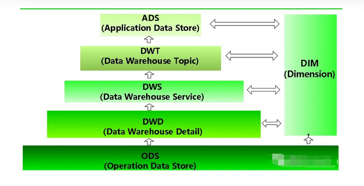

## 工作的思考

### 2022/1/12

​	一个优秀的项目管理团队，它的文档能力都是比较健全的，团队新成员可以通过之前整理的档快速熟悉工作内容，快速进入工作角色，老成员可以根据文档对整个项目进行优化。一个文档能力健全的团队，对于新老成员的更替，几乎是没有影响。

### 2022/1/14

数据集市和数据仓库的主要区别：

- 数据仓库：是企业级的，能为整个企业各个部门的运行提供决策支持手段
- 数据集市：是一种微型的数据仓库，它通常由更少的数据，更少的主题区域，以及更少的历史数据，因此是部门级的，一般只能为某个局部范围内的管理人员服务，因此也称之为部门级数据仓库。

数据仓库的分层思想

- 为什么要分层：
  - 通过分层管理来实现分布完成工作
  - 用空间换时间，通过数据预处理提高效率，提升应用系统 的用户体验，简化数据清洗的过程，使每一层的处理逻辑变得简单
  - 每一层的处理逻辑都相对简单和容易理解，这样我们比较保证每一个步骤的正确性
  - 当数据发生错误时，往往我们只需要局部调整某一个步骤即可

数仓分层的好处

- 数据结构化更清晰：每一个数据分层都有它的作用域和职责，在使用表的时候能更加方便地定位和理解
- 数据血缘追踪：提供给外界使用的是一张业务表，但是这张业务表可能来源很多张表。如果由一张来源表出现问题了，我们可以快速准确的定位到问题，并且清楚每一张表的作用范围

- 增强数据服用能力：减少开发，通过数据分层规范化，开发一些通用的中间层数据，能减少重复计算，提高单张业务表的使用率，提升系统的执行效率。
- 简化复杂问题：把一个复杂的业务分成多个步骤实现，每一层只处理单一的步骤，比较简单和容易理解。而且便于维护数据的准确性，当数据出现问题之后，可以不用修复所有的数据，只需要从有问题的步骤开始修复。
- 减少业务的影响：业务可能回经常发生变化，这样做就不必给一次业务就需要重新接入数据
- 统一数据口径：通过数据分层，提供统一的数据出口，统一对外输出的数据口径

**数仓常见层级**

1. **ODS(Operation Data Store)**

   这层字面意思叫操作型数据存储，存储来自多个业务系统、前端埋点、爬虫获取等的一系列数据源的数据。

   - 又叫“**贴源层**”，这层保持数据原貌不做任何修改，保留历史数据，储存起到备份数据的作用。
   - 数据一般采用lzo、Snappy、parquet等压缩格式，减少磁盘存储空间（例如：原始数据 10G，根据算法可以压缩到 1G 左 右）。
   - 创建分区表，防止后续的全表扫描，减少集群资源访问数仓的压力，一般按天存储在数仓中。

   有些公司还会把ODS层再细分两层：

   **STG**：数据缓冲层，存原始数据；

   **ODS**：对STG层简单清洗后的数据。

2. **DW(Data Warehouse)**

   数仓主体层从ODS层中获得的数据按照主题建立各种数据模型。

   又细分为以下几层：

   **2.1、DWD(Data Warehouse Detail)**

   明细粒度事实层：是以业务过程来作为建模驱动，基于每个具体的业务过程特点，构建最细粒度的明细层事实表（注意是最细粒度）。需要结合企业的数据使用特点，将明细事实表的某些重要维度属性字段做适当冗余，即宽表化处理。明细粒度事实层的表通常也被称为**逻辑事实表**。

   - DWD层是维度建模层

     关于维度建模请查阅[***数仓（三）建模和维度建模***](http://mp.weixin.qq.com/s?__biz=Mzg3ODU4ODMyOQ==&mid=2247484028&idx=1&sn=f3120d2f42ce8775faf0e5633d6f0826&chksm=cf103abaf867b3acba57474b4ca031d33018c6d4a72754dc0d2e879d3f77a1c89175a910d633&scene=21#wechat_redirect)，这层维度建模主要做的4个步骤：

   

   - ODS到DWD层，需要对数据进行清洗做ETL操作（ETL是英文Extract-Transform-Load的缩写)。

   **ETL（\**Extract-Transform-Load\**）**

   将数据从来源端经过抽取(extract)、转换(transform)、加载(load)至目的端的过程。是将业务系统的数据经过抽取、清洗转换之后加载到数据仓库的过程。

   目的是将企业中的分散、凌乱、标准不统一的数据整合到一起，为企业的决策提供分析依据。

   - 主要的数据处理是：去空值、去极值（比方取款300亿）、去业务极值、部分数据脱敏、维度退化等即对业务数据传过来的表进行维度退化和降维（如：商品一级二级、省市县、年月日等）。

***\*2.2、DWS(Data Warehouse Service)\****

- 使轻度汇总层，从ODS层中对用户的行为做一个初步的汇总，抽象出来一些通用的维度：时间、ip、id，并根据这些维度做一些统计值。
- 这里做轻度的汇总会让以后的计算更加的高效，如：统计各个主题对象计算7天、30天、90天的行为， 应对特殊需求（例如，购买行为，统计商品复购率）会快很多不必走ODS层反复拿数据做加工。
- 这层以分析的主题对象作为建模驱动，基于上层的应用和产品的指标需求，构建公共粒度的汇总指标事实表，以宽表化手段物理化模型。构建命名规范、口径一致的统计指标，为上层提供公共指标，建立汇总宽表、明细事实表。
- 服务于 DWT 层的主题宽表，以及一些业务明细数据。

