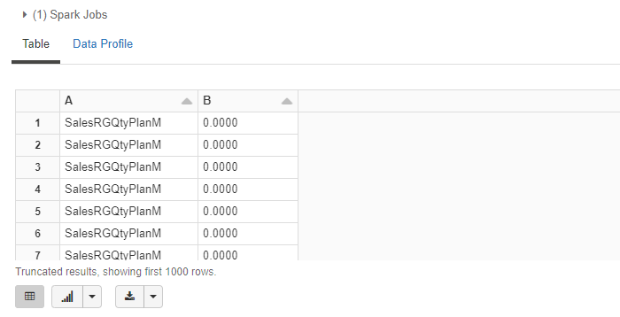
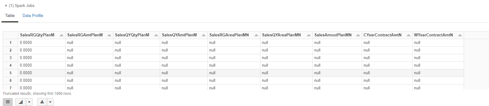
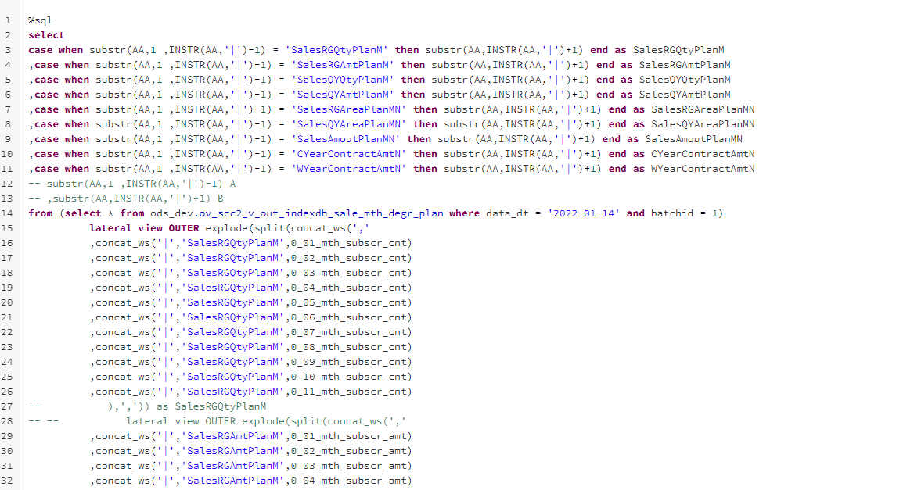

## 工作的思考

### 2022/1/12

​	一个优秀的项目管理团队，它的文档能力都是比较健全的，团队新成员可以通过之前整理的档快速熟悉工作内容，快速进入工作角色，老成员可以根据文档对整个项目进行优化。一个文档能力健全的团队，对于新老成员的更替，几乎是没有影响。

### 2022/1/14

##### 数仓的粒度问题

#### spark sql 关于列转行，使用多次 lateral view ，运行很慢问题

- 第一次运行，发现运行速度非常慢，查看spark log，有OOM 报错
- 频繁full GC

解决方法：

- 将需要的所有列都转成一行，用一列放列转行的列名

- 在select 的时候使用case when 将所需要的列取出

  

sql 的写法：

